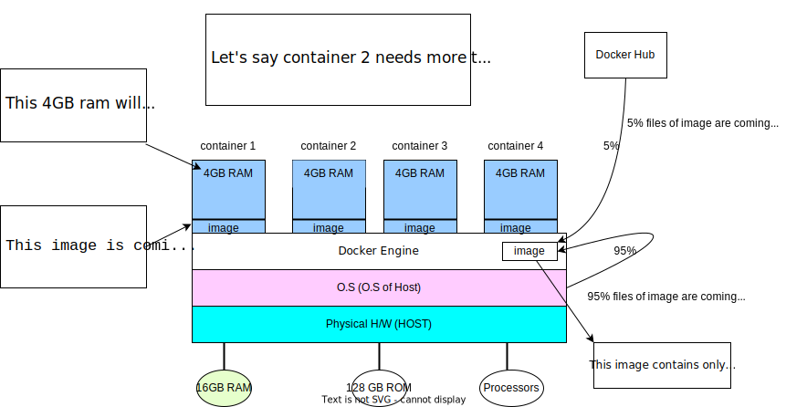

### Why Docker is needed ??
##### ANS:-->>
---
let's say we create an application and its working fine in dev environment now we send it to the testing team but there this appllication is not working fine bcz testing team might not have same versions of all the software required or may be testing team has not all the required files to run this software in their environment (which were present in development environment)
So this is a dependencies issue.
To solve this issue we can use containerisation concept :--> We can craete a virtual machine icluding the application,same operating system(as development environment) and with all the softwares/files required and we can create an image of this virtual machine and send it to the testing team now the testing team will use this virtual machine and run the software and it will work fine as in development environment.
***

**There are three types of virtual machine concept :**

        1. using hypervisor  :--> This is a basic virtualisation concept
        2. AWS EC2 instances :--> Can say better version version of virtualisation
        3. Docker            :--> Advance level of virtualisation and removing hypervisor concept of VMWare
> **Main differences of containerisation in VM and Docker**
   
    1. 
      Virtual machine has its own OS
      Docker container has not its own OS :-> it uses OS of physical hardware
    2. 
       Once VM takes an amount of RAM/ROM it won't return to pyhsical hardaware irrespective of its doing any work or not
       Docker container is not permanent if its not running any job it will return its 
       RAM and ROM to the original physical hardware which can be used by other containers if needed
    3. 
       In VM we need to insatall its own operating system separately which takes more than 2 GB of RAM (in case of windows) of 
       Host machine (physical hardaware).
       Docker use almost 95% of files of Host's OS and 5% files it takes from Docker Hub thus it does not create any personal OS so does not take more 
       RAM of Host machine.   
    4. 
       Docker does O.S level virtualization whether VMware does hardware level virtualization.  

#### Hardware level virtualization VS OS level virtualization
---
> *Hardware Level Virtualization* :

---
> *O.S Level Virtualization* :

#### Features of Docker :
  
    1. We will create container in development and create one image of this container and share with 
    Testing team or with anyone else and they can use this image to create docker container and run the Application.
    2. Docker container contains only software not OS.
    3. Docker uses container on the host OS to run application, It allows applications to use the same linux  Kernel as on the host computer rather than creating a whole Virtual O.S
    4. We can run docker on any operating system but Docker runs its Docker engine natively on linux distributions
    5. Docker written in `go` language.
    6. Docker performs O.S level Virtualization, also known as containerization.
    7. Docker is a PaaS. 
#### Advantages of Docker :
 
    1. No pre allocation of RAM
    2. CI efficiency :-->> Docker enabls us to build an image and that can be used across every deployment process.
    3. less cost :--> its cheaper than even AWS EC2 instances bcz no need to provide any OS and no RAM earlier than running process.
    4. Light weight :--> means the applications which use less resources,does not need RAM no need of OS. 
    5. It can run on Physical hardware/Virtual Hardware/or on Cloud.
    6. We can re-use the image
                                          